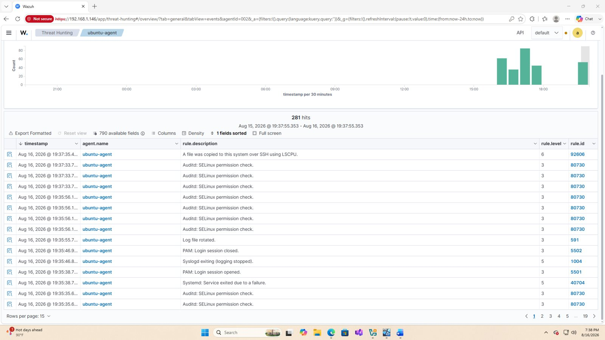
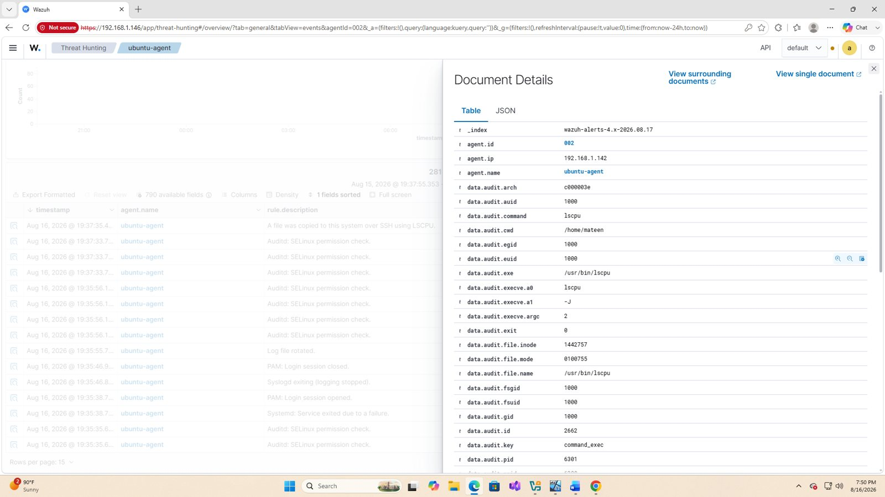
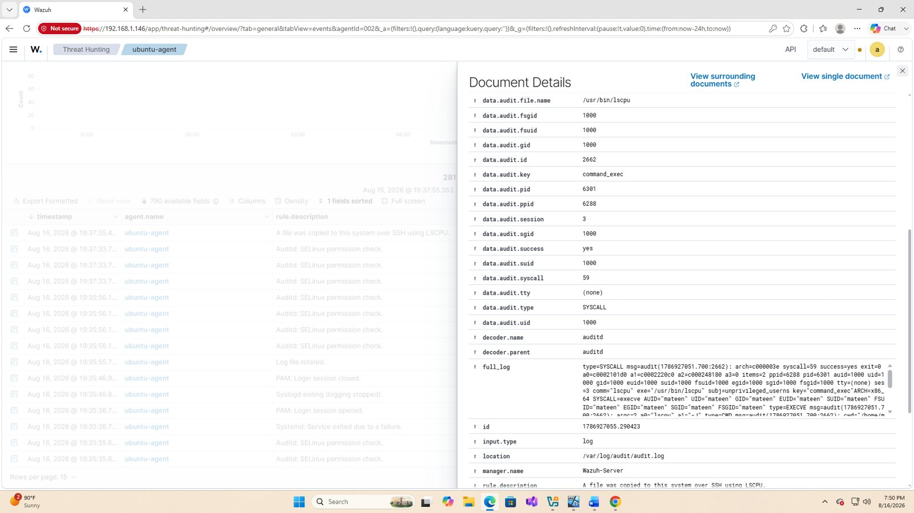

# Linux auditd Command Monitoring

This investigation extends the lab to a monitored Ubuntu endpoint using Linux `auditd` telemetry forwarded into Wazuh.

An audit rule was configured with the key `command_exec` to record process execution activity. Wazuh ingested events from `/var/log/audit/audit.log`, allowing command execution to be searched and investigated from the Threat Hunting interface.

## Investigation fields

Useful fields visible in the events include:

- `data.audit.command`
- `data.audit.exe`
- `data.audit.execve.a0` / argument fields
- `data.audit.cwd`
- `data.audit.auid`
- `data.audit.uid`
- `data.audit.pid` and `data.audit.ppid`
- `data.audit.key`
- `data.audit.success`

During validation, Wazuh identified execution of `/usr/bin/lscpu` and mapped the resulting activity to MITRE ATT&CK T1021.004 (SSH) because it occurred in the context of the controlled SSH activity. This is a useful example of why an analyst must review raw telemetry and context rather than treating a detection title as proof of malicious behavior.

