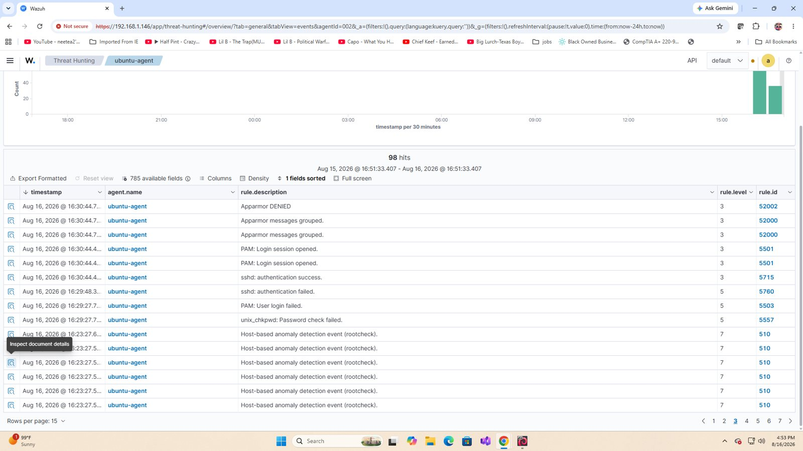
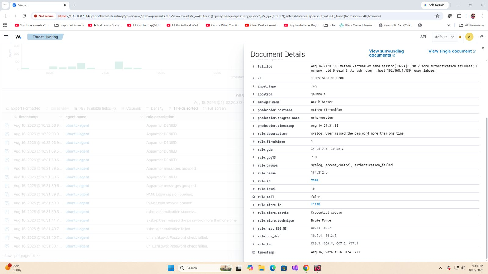

# SSH Authentication Analysis

This investigation documents controlled SSH authentication activity generated from Kali Linux against the monitored Ubuntu endpoint.

## Evidence summary

- Source: `192.168.1.139`
- Target: `192.168.1.142`
- Target account: `labuser`
- Service: SSH / TCP 22
- Multiple failed authentication attempts were followed by a successful login and PAM session creation.
- Repeated password failures triggered a Wazuh Level 10 alert during testing.

The important analytical point is that failed logins alone do not prove malicious activity. The failed-to-success sequence increases suspicion and requires context such as source authorization, account ownership, and post-authentication behavior.

## Analyst response considerations

If the source were unauthorized, response actions could include resetting or disabling the affected account, terminating unauthorized sessions, reviewing activity after login, and blocking or isolating the source when appropriate.

